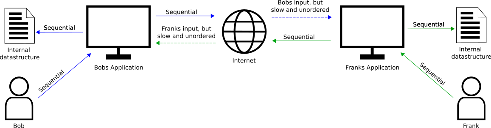

Overview
========

Traditional most applications are build with a datamodel suitable for single user access, all data update algorithms and storge policies are build with the mindset of one application manipulating the data.

|tradition_application|

In this scenario the app is responsible for ensuring data integrity and validity, and it usually does so by guiding the user with allowed or forbidden interactions. This works well as user input comes in syncronously, one action after annother, and hence the application can ensure that only valid actions can occure based on current state of the data.

Now assume you want to enable the given application for direct, realtime collaborative editing. The first thing that comes to mind is to simply forward all user inputs from one application to the other. 

|collaboration_application|

However, it becomes imediately clear that the principle of syncronous input is not valid anymore: there are multiple input sources now for the application. Even worse, the remote input source is delayed and the user actions can arrive unordered. This means that the external inputs may not fit the current application state, and hence need to be rejected. This information must of course be provided back to the source, but this takes time again, and it could easily be that the source applicaton is already way ahead of the rejected action. This approach is clearly flawed, and it is almost impossible to keep the applicaion states syncronized this way.

It becomes clear that there must be a central entity which defines the current state for all applications, some kind of system that every update is written to and where each application can inquery the currently valid data. Using a database for that comes to mind. It does provide a consistent view on data and allows to be accessed from multiple applications worldwide. Pefect, rigth? Not really. Imagine the following sequence of events:

|database_problem|

This would result in both applications think the sate is different. Of course the applications can read the state again to make sure they have it rigth, but it still would not have any guarantee that the state is still valid when the query finished. But when a application cannot be sure what the current state is, how can it write a new one, as the update may not be allowed?

.. note:: Databases do not provide any way of informing about updates. So you need to inform the other aplications about your changes manually, which provides almost the same challenge of synchronisation and ordering as the state manipulation itself

We can conclude that some verification logic is needed next to the database, that makes sure only valid writes occure and makes updates fail if invalid.

Shared custom data and logic
----------------------------

Our solution for this problem is a framework that lets you easily create custom datastructures, including all kinds of custom logic. You create the structure and logic needed for your application, OCP handles the syncronisation and data transfer across unlimited clients. 

Remember the purpuse of the data and logic entity we are creating: it should help your application in keeping a shared state while multiple users edit the data. Therefore the structure of our custom datastructure and logic should only be tailored towards that, and not towards recreating the exact internals  of your application. You already coded efficient handling of all the storage details, so you should be able to reuse this as much as possible. With this in mind, OCP provides two mechanisms:

* Typed and parsble data for structural intend
* Raw binary for storage of large amounts of data

You build up the collaboration structure and logic with parsable (hence user readable) data, and all the detailed and complex stuff you store as raw data within the structure. 
With this you are able to setup the simplest collaboration structure that exists: storing all data of your application as big blob, and restricting updates to the whole thing when one user is editing. 

|blocking|

After each edit in your application you safe everything and upload it as binary blob to the shared state. The other apps would than be informed that data has a new value, and can download it and load it into their internal structure. OCP would gurantee that each application would see the same data block at every time, no matter the ordering and delays when different apps want to write it. 

However, this simple approach can lead to loss of changes: Imagine two apps starting edits from the same state, but one finishs earlier. It would upload the new data. But then the second finishes, and uploads its data, without knowing of the firsts apps edit, which is than lost. This gets worse the longer a edit/recalculate/upload cycle takes. It would not lead to invalid states, but strange behaviour for the user. This could be changed by introducing a structural data element and some logic for keeping track of versions:

|versioned_blocking|

Now each change that was commited will stay, as every application is only allowed to change the data if the new one used the last available version. This can still lead to loss of changes, in the earlier example the first finishing application will have its changed stored, the second finishing ones will be invalid and not distributed.

.. note:: If the applications call to SetData returned an error it must recreate the shared state, to be inline with all other apps. It than could theoretical try to apply the user change on this common state (if still valid) to try to reupload.

With this basic understanding we can go fancy: Assuming we have a graphics editing application, we realize that the graphic layers are actually fully independent. A change to a single layer does not affect the other layers at all. So why do we not allow users to cuncurrently edit them? Easily done:

|layer_versioned_blocking|

Datastructure Markup Language
-----------------------------

OCP provides a custom markup language to create such datastructures and logic. They main building blocks you use are:

* **Document**: A document is the container for all your custom types and logic. A document is basically your created database
* **Data objects**: Objects are the main building block for a hirarchical data structure withi the document. There are predefined ones like Map and List, and from those you build your own objects by combining and cutomizing them.
* **Properties**: Each provided object has properties that define its behaviour. You can also add your own, eihter for cutomisation of your code or for data storage
* **Functions**: You code custom functions within your objects, which are callable from other objects and directly from your application
* **Events**: Each provided object has a set of predefined events, like "onNewEntry" for a map, and you can even define your own events. You can define code within the objects that will be executed on event emitting, or listen for the events in your application 

See for example the following data structure:

|custom_datastructure|

This document provides you with a vector that holds custom maps. You can add more of those custom maps by calling MyMainObject.AppendNew(), remove entries, access them for manipulation etc.. Each entry in this vector is a Map object, in our case with string keys and integer values. Of course they could be other types, and the values coulb even be annother custom object, further building your hirarchy. With this you are extremely flexible building a data layout to your needs.

Now to the logic: The main object has a function which is called when event onNewEntry is emitted, which happens always when a new entry is added to the vector. The function C is than called, and could check if it is ok to create a new entry based on all available data. If yes, it just returns doing nothing, if not it can raise an error and the whole update fails. See here for comparison the timelines for a successfull and a failing update of the shown document:

|document_update|

You can setup this exact document with a the following DML code:

.. code-block:: javascript
    
   Vector {
       .name: "MyMainObject"
    
        property string A: "Hello"
        property string B: "World"
        
        function C() {
            //my Javascript code
        }
        
        .onNewEntry: function() {
            MyMainObject.C()
        }
        
        .type: Map {
            .name: "MyVectorEntry"
            
            property int E: 1
            property var F: 2
            
            .key: string
            .value: int
        }
    }

With this hirarchy setup you now can easily access your datastructure from outside, simply like this:

.. code-block:: bash

    MyMainObject.C         //call function
    MyMainObject.1.E       //read property E of first entry in vector
    MyMainObject.0.Second  //read map entry "Second" of the first map in the vector

Peer to Peer setup
------------------
